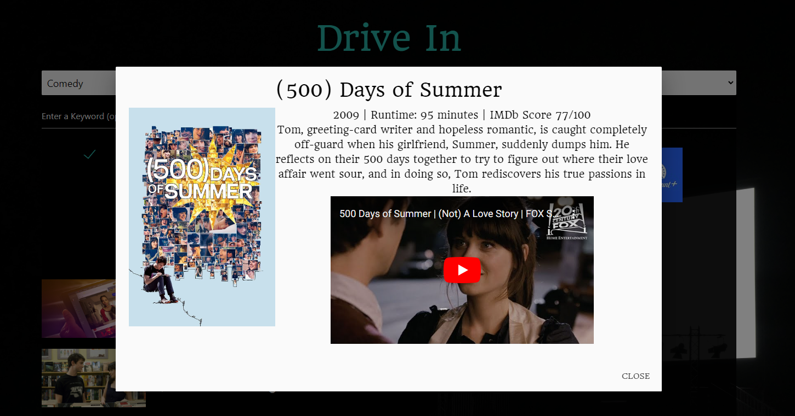

# Parkers-Drive-In

## User Story

AS A viewer that is a cinema enthusiast.
I WANT to provide an appealing, user friendly interface, that provides information about movies on streaming services.
SO THAT the embarrassment of scrolling for hours on end; unable to find entertainment and ultimately being told to pass the remote can be avoided.

## Acceptance Criteria

GIVEN I input a genre, enter a keyword, and select the streaming services I currently have.
WHEN I click the Search Button
THEN I am shown a list of movies that follow under my selected input.  
GIVEN I find my desired movie.
WHEN I click "More Info".
THEN a Expanded modal pops up; With a short description of the movie, year released, Title, and rating of the movie.
GIVEN I am done reading the information.
WHEN i click "Close" 
THEN it closes out the modal and returns to the movie list. 

## Description

Improve the user experience by implementing parameters to pinpoint more accurate information regarding options for “Streaming Platforms”.
As well as providing a user friendly Interface, that is simple, straight to the point, and ultimately provides great information regarding desired movies.
Gives compelling information such as a Short Description, Title, Runtime, IMDb Ratings, year released, as well as a Image Poster of the movie and Youtube Link.  

## Images

.png)
.png)
.png)

## Wire-Frame

## Repository

https://github.com/JakeCas77/Parkers-Drive-In

## Deployment 

https://jakecas77.github.io/Parkers-Drive-In/

## Credits
Jake Casas - https://github.com/JakeCas77
Jeffrey Parker - https://github.com/jeffrpar
Raheim Devins - https://github.com/RaheimDevins 
Jose Luna - https://github.com/JoseLuna2023
Kalynn Powell - https://github.com/kmarie0420

CSS Framework - https://materializecss.com/
Movie of the Night API - https://rapidapi.com/movie-of-the-night-movie-of-the-night-default/api/streaming-availability/
YouTube iframe API - https://developers.google.com/youtube/iframe_api_reference

Background Image - https://unsplash.com/ 
Font - https://fonts.google.com/ 

